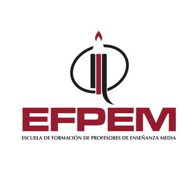

<!DOCTYPE html>
<html>
<head>
	
</head>
<body>

<table width="100%" border="0">
	<tr align="center">
		<td colspan="2">
			
 <h1> PROYECTOS DE PROGRAMACION</h1>

		</td>
	</tr>
	<tr align="center">
		<td colspan="2">
			
<h4> 16 / noviembre / 2020 </h4>

		</td>
	</tr>
	<tr>
		<td colspan="2">
			

				Descripción:  
				Este repositorio es para uso unicamente educativo, con el fin de aprender a compartir proyectos de programación.
			

		</td>
	</tr>
	<tr>
		<td colspan="2">
		<table border="2" width="100%">
			<tr>
				<td>
					<b>Nombre:</b>
				</td>
			</tr>
			<tr>
				<td>
					<b>EDWIN ARNALDO MARTINEZ CHINCHILLA</b>
				</td>
			</tr>
		</table>
		</td>
	</tr>
	<tr>
		<td colspan="2">
			Enlaces:  
			<ul>
				<li>
					<a href="https://youtu.be/MMqbBF88b1s">VIDEO EN YOUTUBE</a>
				</li>				
			</ul>
		</td>
	</tr>
	<tr>
		<td>
			
		</td>
		<td> 
			
		</td>
	</tr>

</table>
</body>
</html>